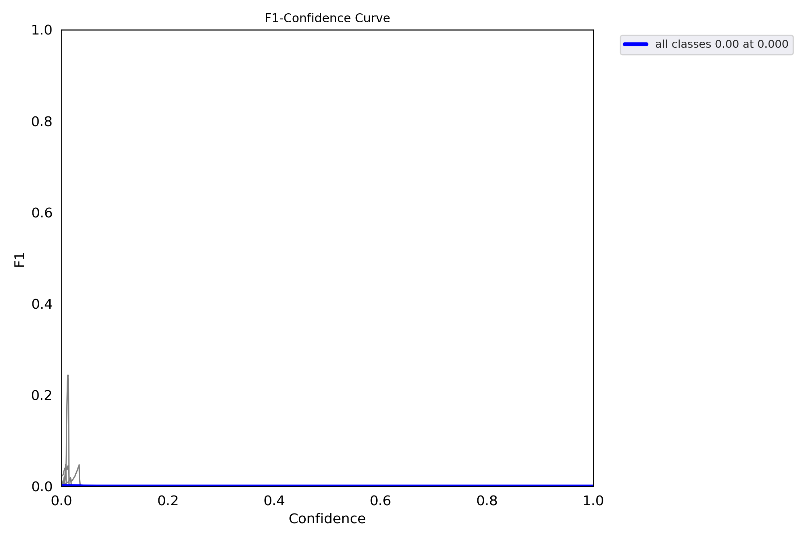
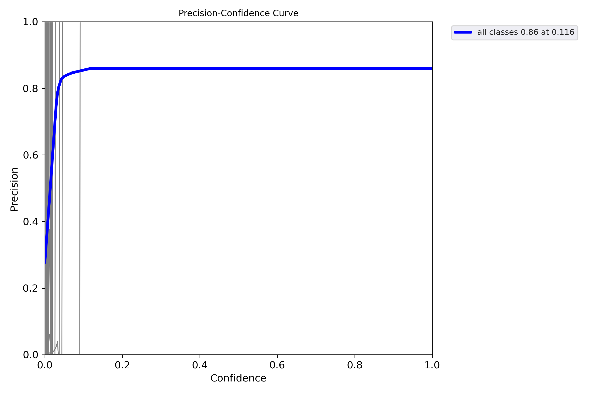
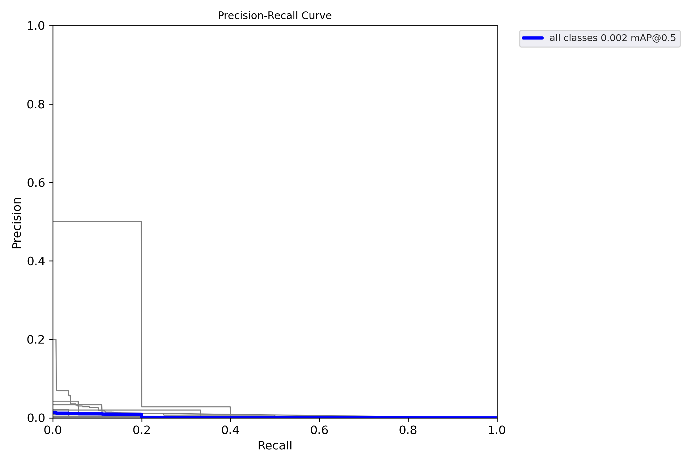
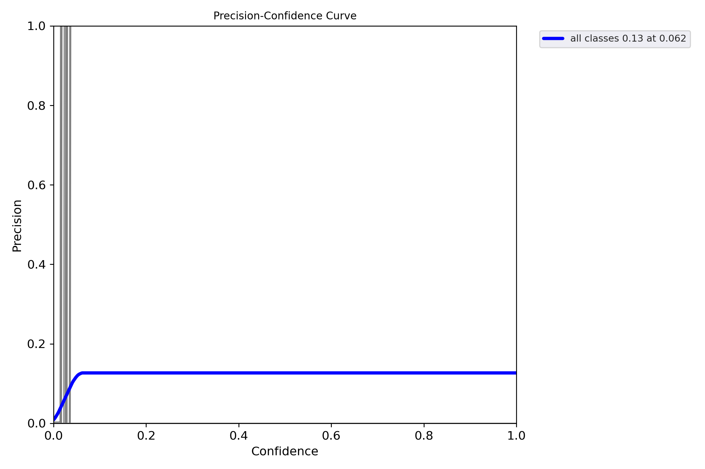
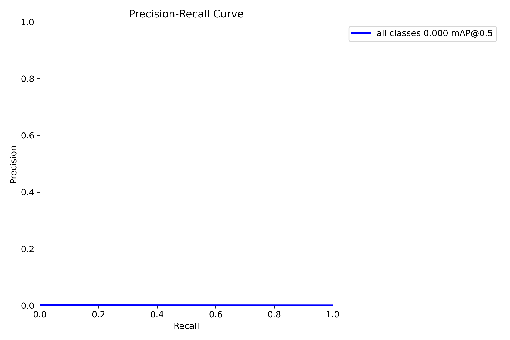

# Experiment Details
User: 

# Metrics
## Experiment metrics
| Path                       | anchor_t   | box   | cls   | cls_pw   | copy_paste   | degrees   | fl_gamma   | fliplr   | flipud   | hsv_h   | hsv_s   | hsv_v   | iou_t   | lr0   | lrf   | mixup   | momentum   | mosaic   | obj   | obj_pw   | perspective   | scale   | shear   | translate   | warmup_bias_lr   | warmup_epochs   | warmup_momentum   | weight_decay   |
|----------------------------|------------|-------|-------|----------|--------------|-----------|------------|----------|----------|---------|---------|---------|---------|-------|-------|---------|------------|----------|-------|----------|---------------|---------|---------|-------------|------------------|-----------------|-------------------|----------------|
| runs/train/exp/results.csv | -          | -     | -     | -        | -            | -         | -          | -        | -        | -       | -       | -       | -       | -     | -     | -       | -          | -        | -     | -        | -             | -       | -       | -           | -                | -               | -                 | -              |
| runs/train/exp/hyp.yaml    | 4.0        | 0.05  | 0.5   | 1.0      | 0.0          | 0.0       | 0.0        | 0.5      | 0.0      | 0.015   | 0.7     | 0.4     | 0.2     | 0.01  | 0.01  | 0.0     | 0.937      | 1.0      | 1.0   | 1.0      | 0.0           | 0.5     | 0.0     | 0.1         | 0.1              | 3.0             | 0.8               | 0.0005         |

## Metrics Diffs
| Path                    | Metric          | HEAD   | workspace   | Change   |
|-------------------------|-----------------|--------|-------------|----------|
| runs/train/exp/hyp.yaml | anchor_t        | 4.0    | 4.0         | 0.0      |
| runs/train/exp/hyp.yaml | box             | 0.05   | 0.05        | 0.0      |
| runs/train/exp/hyp.yaml | cls             | 0.5    | 0.5         | 0.0      |
| runs/train/exp/hyp.yaml | cls_pw          | 1.0    | 1.0         | 0.0      |
| runs/train/exp/hyp.yaml | copy_paste      | 0.0    | 0.0         | 0.0      |
| runs/train/exp/hyp.yaml | degrees         | 0.0    | 0.0         | 0.0      |
| runs/train/exp/hyp.yaml | fl_gamma        | 0.0    | 0.0         | 0.0      |
| runs/train/exp/hyp.yaml | fliplr          | 0.5    | 0.5         | 0.0      |
| runs/train/exp/hyp.yaml | flipud          | 0.0    | 0.0         | 0.0      |
| runs/train/exp/hyp.yaml | hsv_h           | 0.015  | 0.015       | 0.0      |
| runs/train/exp/hyp.yaml | hsv_s           | 0.7    | 0.7         | 0.0      |
| runs/train/exp/hyp.yaml | hsv_v           | 0.4    | 0.4         | 0.0      |
| runs/train/exp/hyp.yaml | iou_t           | 0.2    | 0.2         | 0.0      |
| runs/train/exp/hyp.yaml | lr0             | 0.01   | 0.01        | 0.0      |
| runs/train/exp/hyp.yaml | lrf             | 0.01   | 0.01        | 0.0      |
| runs/train/exp/hyp.yaml | mixup           | 0.0    | 0.0         | 0.0      |
| runs/train/exp/hyp.yaml | momentum        | 0.937  | 0.937       | 0.0      |
| runs/train/exp/hyp.yaml | mosaic          | 1.0    | 1.0         | 0.0      |
| runs/train/exp/hyp.yaml | obj             | 1.0    | 1.0         | 0.0      |
| runs/train/exp/hyp.yaml | obj_pw          | 1.0    | 1.0         | 0.0      |
| runs/train/exp/hyp.yaml | perspective     | 0.0    | 0.0         | 0.0      |
| runs/train/exp/hyp.yaml | scale           | 0.5    | 0.5         | 0.0      |
| runs/train/exp/hyp.yaml | shear           | 0.0    | 0.0         | 0.0      |
| runs/train/exp/hyp.yaml | translate       | 0.1    | 0.1         | 0.0      |
| runs/train/exp/hyp.yaml | warmup_bias_lr  | 0.1    | 0.1         | 0.0      |
| runs/train/exp/hyp.yaml | warmup_epochs   | 3.0    | 3.0         | 0.0      |
| runs/train/exp/hyp.yaml | warmup_momentum | 0.8    | 0.8         | 0.0      |
| runs/train/exp/hyp.yaml | weight_decay    | 0.0005 | 0.0005      | 0.0      |

# Train plots
## confusion matrix

## F1 curve

## labels correlogram

## labels

## P curve

## PR curve

## R curve

# Val plots
## confusion matrix

## F1 curve

## P curve

## PR curve

## R curve

